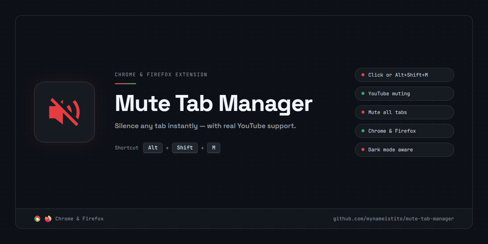

# Mute Tab Manager

> Silence any tab instantly — with real YouTube support.



---

## Table of Contents

- [Why This Exists](#why-this-exists)
- [Features](#features)
- [Installation](#installation)
- [Keyboard Shortcut](#keyboard-shortcut)
- [Development](#development)
- [How It Works](#how-it-works)
- [Permissions](#permissions)
- [License](#license)

---

## Why This Exists

Chrome's built-in tab mute (`chrome.tabs.update({ muted: true })`) silences a tab's audio output, but it does not update YouTube's player UI or the underlying `HTMLVideoElement.muted` state. This extension supplements the native mute by also directly setting `video.muted` via a content script, keeping YouTube's player in sync and surviving SPA navigations and page reloads.

## Features

- **Mute any tab** — click the toolbar icon or press `Alt+Shift+M`
- **YouTube support** — directly mutes `<video>` elements, surviving SPA navigation and page reloads
- **Mute all tabs** — right-click the toolbar icon → "Mute All Tabs"
- **Visual badge** — "M" badge appears on the icon when a tab is muted
- **Dark mode aware** — icon adapts to system light/dark preference
- **Persistent state** — muted tabs stay muted across navigation within the same session
- **Chrome & Firefox** — both browsers supported from the same codebase

## Installation

### From Source

```bash
bun install
bun run build
```

**Chrome:**

1. Open `chrome://extensions`
2. Enable **Developer mode** (top-right toggle)
3. Click **Load unpacked**
4. Select the `apps/chrome/dist/` folder

**Firefox:**

1. Open `about:debugging` → **This Firefox**
2. Click **Load Temporary Add-on…**
3. Select `apps/firefox/dist/manifest.json`

> For a permanent Firefox install, sign the extension via [addons.mozilla.org](https://addons.mozilla.org/developers/) using the built `apps/firefox/dist/` folder.

## Keyboard Shortcut

`Alt+Shift+M` toggles mute on the active tab.

- Chrome: customise at `chrome://extensions/shortcuts`
- Firefox: customise at `about:addons` → gear icon → **Manage Extension Shortcuts**

## Development

```bash
bun install           # install dependencies and set up workspace symlinks
bun run build         # production build for all packages → apps/*/dist/
bun run test          # run all test suites
bun run typecheck     # TypeScript check across all packages
bun run check         # lint + format check
bun run fix           # auto-fix lint + format issues
```

Individual packages can be worked on directly:

```bash
cd apps/chrome && bun run build:watch   # rebuild Chrome extension on file changes
cd apps/firefox && bun run build:watch  # rebuild Firefox extension on file changes
```

### Monorepo Structure

```text
mute-tab-manager/
├── apps/
│   ├── chrome/          # Chrome MV3 extension (@mute-tab-manager/chrome)
│   │   ├── src/         # service-worker.ts, offscreen.ts
│   │   ├── public/      # manifest.json, offscreen.html, icons/
│   │   └── __tests__/
│   └── firefox/         # Firefox MV3 extension (@mute-tab-manager/firefox)
│       ├── src/         # service-worker.ts (matchMedia-based dark mode)
│       ├── public/      # manifest.json, icons/
│       └── __tests__/
├── packages/
│   └── shared/          # Shared code (@mute-tab-manager/shared)
│       └── src/         # constants.ts, types/messages.ts, content-youtube.ts
└── scripts/
    └── release.ts       # Builds and publishes both zips to a GitHub release
```

Built with [Bun](https://bun.sh) and TypeScript, orchestrated with [Turborepo](https://turbo.build). Linted and formatted with [Ultracite](https://github.com/haydenbleasel/ultracite) (Biome).

## How It Works

| Component | Location | Purpose |
|---|---|---|
| Service worker (Chrome) | `apps/chrome/src/service-worker.ts` | Handles toolbar clicks, keyboard shortcuts, context menus, badge/icon updates, and tab lifecycle |
| Service worker (Firefox) | `apps/firefox/src/service-worker.ts` | Same as Chrome, but uses `matchMedia()` directly instead of an offscreen document |
| Content script | `packages/shared/src/content-youtube.ts` | Runs on YouTube pages; directly sets `HTMLVideoElement.muted`, watches for new `<video>` elements via `MutationObserver` |
| Offscreen document | `apps/chrome/src/offscreen.ts` | Chrome only — detects system dark/light mode via `window.matchMedia` and reports back to the service worker |

## Permissions

| Permission | Chrome | Firefox | Reason |
|---|:---:|:---:|---|
| `tabs` | ✓ | ✓ | Query and mute all open tabs |
| `activeTab` | ✓ | ✓ | Access the currently active tab |
| `contextMenus` | ✓ | ✓ | Add right-click menu items to the toolbar icon |
| `offscreen` | ✓ | — | Create an offscreen document for dark mode detection (Chrome only) |
| `storage` | ✓ | ✓ | Persist muted state across tab navigations |
| `*://*.youtube.com/*` | ✓ | ✓ | Inject content script to mute YouTube video elements |

## License

MIT — see [LICENSE](LICENSE).
